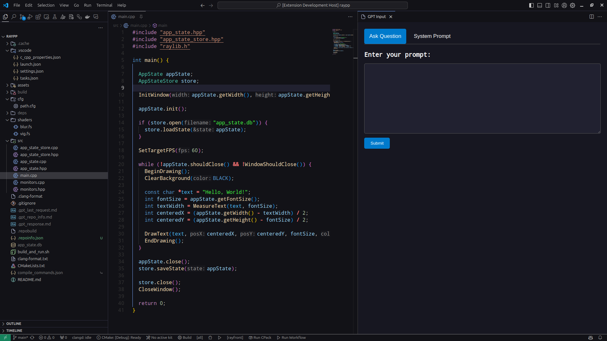

# TheCodeGPT

This small extension works as a wrapper to ask ChatGPT questions while offering information about the current workspace as part of the system prompt, giving it a chance to reply with more informed answers.

The default bind key to ask a question is `Alt+q`




## Features

The extension will generate information about the workspace, given the settings provided by a JSON file called `.repoinfo.json` that must exist in the workspace's root directory.

Such JSON object will inform about:

- The code extensions that should be included in the prompt context;

- Which directories should be ignored while traversing and looking for files that end with the desired extensions;

- Which specific files should be manually added even though they don't belong to the list of tracked code extensions.

Here follows a `.repoinfo.json` example:

```JSON
{
  "codeFileExtensions": [".cpp", ".hpp", ".sh", ".fs", ".vs"],
  "ignoredDirectories": [
    ".git",
    ".cache",
    "deps",
    "build"
  ],
  "includeSpecificFiles": ["CMakeLists.txt", "cfg/path.cfg"]
}
```

## Requirements

You must have a `.repoinfo.json` as described above in the root directory of the workspace you're using this extension with; otherwise, you risk parsing many files that shouldn't be included (as project dependencies).

For now, to prevent the risk of accidentally leaking an API key into repos, this extension retrieves the `OPENAI_API_KEY` from an environment variable (that I'm currently setting by using:

```BASH
 source ~/.openai_api_key
 ```
 
 ... on my `.profile` file on Linux, while making sure such `.openai_api_key` is not tracked by any of my repos). I'll update this method once I can find the time.

## Extension Settings

A `.repoinfo.json` must be present in the root directory of the workspace you're using this extension on.

`.repoinfo.json` example:

```JSON
{
  "codeFileExtensions": [".cpp", ".hpp", ".sh", ".fs", ".vs"],
  "ignoredDirectories": [
    ".git",
    ".cache",
    "deps",
    "build"
  ],
  "includeSpecificFiles": ["CMakeLists.txt", "cfg/path.cfg"]
}
```

Here follows another `.repoinfo.json` example, that would be more suitable for a React + TypeScript project:

```JSON
{
  "codeFileExtensions": [".ts", ".tsx", ".js", ".cjs", ".mjs"],
  "ignoredDirectories": [
    ".git",
    "node_modules",
    "build",
    "dist"
  ],
  "includeSpecificFiles": [".eslintrc", ".prettierrc", "package.json"]
}
```


## Known Issues

I just started drafting this extension, so I wouldn't recommend it for projects in production. Lots of changes are expected.

For now, until I can find some time to improve the extension settings, I'm using hardcoded settings for the ChatGPT request, which follows:

```Javascript
const response = await fetch("https://api.openai.com/v1/chat/completions", {
      method: "POST",
      headers: {
        Authorization: `Bearer ${apiKey}`,
        "Content-Type": "application/json",
      },
      body: JSON.stringify({
        model: "gpt-4",
        messages: [
          { role: "system", content: systemPrompt },
          { role: "user", content: userInput },
        ],
        max_tokens: 1500,
        temperature: 0.7,
        stream: true,
      }),
    });
```

In further updates I plan to gather such settings from the `.repoinfo.json` file, but I still haven´t decided the granularity level I want for this.
